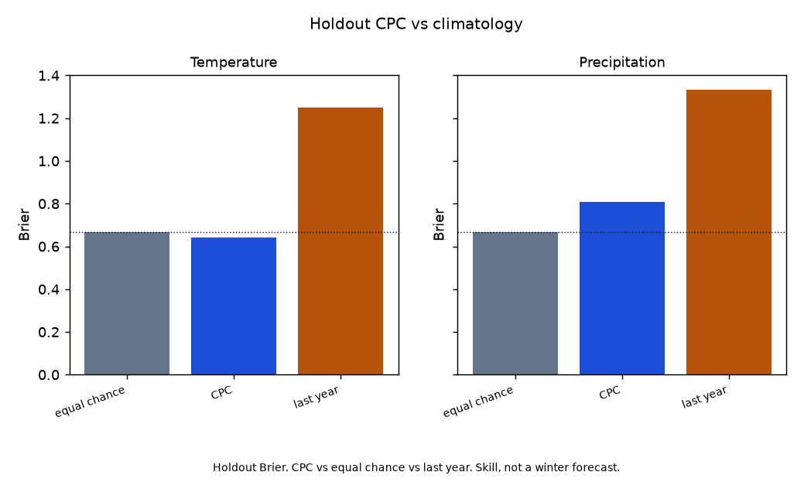
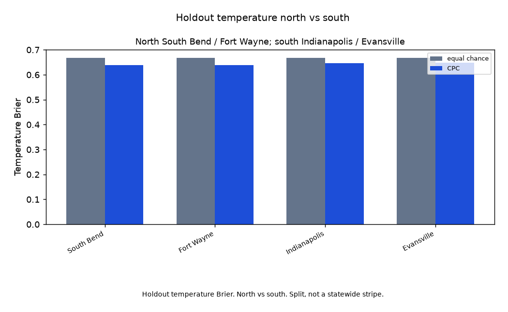

# Indiana CPC DJF skill vs equal-chance climatology

Do issued CPC DJF temperature and precipitation outlooks beat climatology at South Bend, Fort Wayne, Indianapolis, and Evansville?

Yes on temperature; no on precipitation. Locked `a95a16b`. Holdout CPC temperature Brier is 0.643 against equal chance 0.667. Precipitation Brier is 0.809 against 0.667. That split is the product. Do not average it. North and south temperature both beat equal chance. Evansville precipitation Brier 0.495 stays in the station table; it is not a statewide precip win. Last year is the second bar (temperature Brier 1.25, precipitation 1.33). Confirmation DJF 2025-26 does not reverse the holdout. Fixture skill does not rescue live.

Amount science `ac36f0f`, JJA miss `1416da1`, winter-lake miss `6b47f21`, DJF snow holdout `9aa7935`, and freeze-date `28941fb` stay frozen. The contestant is CPC. The bar is climatology.

Parents: [](https://github.com/martialsystems/indiana_djf_snow_tercile)
[](https://github.com/martialsystems/indiana_freeze_date)
[](https://gist.github.com/martialsystems/e5de316dbb5f672573906572730e3735)
[](https://gist.github.com/martialsystems/b5f900aad37487bb8c0206a321c1ed5c)


Holdout n=24 station-winters per variable on the four cores (DJF 2019-20 through 2024-25). Train: DJF 1991-92 through 2018-19. Confirmation DJF 2025-26 is out of train and out of tercile cuts.

Four cores: South Bend `USW00014848`, Fort Wayne `USW00014827`, Indianapolis `USW00093819`, Evansville `USW00093817`. August-issued CPC DJF, lead 4. Forecast divisions: 23 Southern Michigan (South Bend, Fort Wayne), 24 East-central Illinois (Indianapolis), 39 Western Kentucky (Evansville).



Figure 1. Holdout Brier. CPC temperature 0.643 vs equal chance 0.667. Precipitation 0.809 vs 0.667. Skill, not a winter forecast.



Figure 2. Holdout temperature Brier. North 0.638 vs south 0.648, both against equal chance 0.667. Split, not a statewide stripe.

## Live skill (held-out winters)

Locked from `logs/in_live/stage_c_report.json`. Brier. Four cores. 7/24 counts are not the method.

| Variable | CPC Brier | EC Brier | Last year Brier | CPC hit | EC hit | Last year hit | Non-EC n |
|----------|----------:|---------:|----------------:|--------:|-------:|--------------:|---------:|
| Temperature | 0.643 | 0.667 | 1.25 | 0.62 | 0.33 | 0.38 | 10 / 24 |
| Precipitation | 0.809 | 0.667 | 1.33 | 0.33 | 0.33 | 0.33 | 17 / 24 |

### Per station (Brier)

| Station | Variable | CPC | Equal chance | Last year |
|---------|----------|----:|-------------:|----------:|
| South Bend `USW00014848` | Temperature | 0.638 | 0.667 | 1.33 |
| South Bend `USW00014848` | Precipitation | 1.107 | 0.667 | 1.33 |
| Fort Wayne `USW00014827` | Temperature | 0.638 | 0.667 | 1.00 |
| Fort Wayne `USW00014827` | Precipitation | 0.852 | 0.667 | 1.33 |
| Indianapolis `USW00093819` | Temperature | 0.647 | 0.667 | 1.33 |
| Indianapolis `USW00093819` | Precipitation | 0.783 | 0.667 | 1.33 |
| Evansville `USW00093817` | Temperature | 0.649 | 0.667 | 1.33 |
| Evansville `USW00093817` | Precipitation | 0.495 | 0.667 | 1.33 |

Confirmation DJF 2025-26 temperature Brier equals equal chance (0.667). Precipitation Brier 0.950. That does not reopen a page.

## Stage 0

Synthetic DJF TAVG and PRCP at the four cores with planted CPC skill. Fixture skill does not rescue live.

```bash
python3.12 -m venv .venv
source .venv/bin/activate
pip install -r requirements.txt
PYTHONPATH=src:. python3 scripts/run_fixture.py logs/stage0_fixture
.venv/bin/python -m pytest tests -q
PYTHONPATH=src:. python3 scripts/run_live.py logs/in_live data/raw
```

Empty GHCND TAVG or PRCP for a required core stops (`run_live.py` exit 2). Two figures max.

| File | Role |
|------|------|
| [METHODOLOGY.md](METHODOLOGY.md) | Locked contract |
| [AGENTS.md](AGENTS.md) | Agent rules |
| [CHECKLIST.md](CHECKLIST.md) | Operator list |
| `src/cpcskill/` | GHCND TAVG/PRCP, CPC August lead 4, split, skill, figures |
| `cpcforge/` | GraphForge pin |

[](https://martialsystems.github.io/indiana_wx_pages/)
